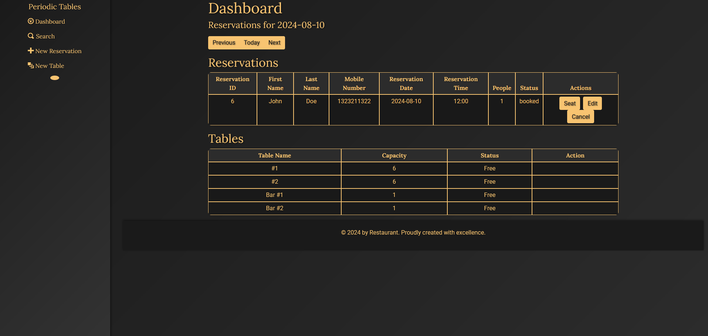
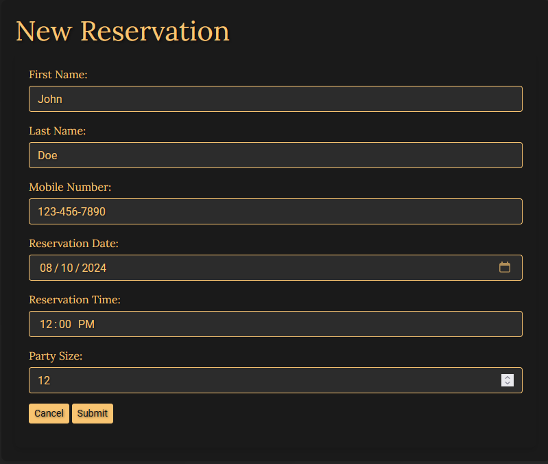
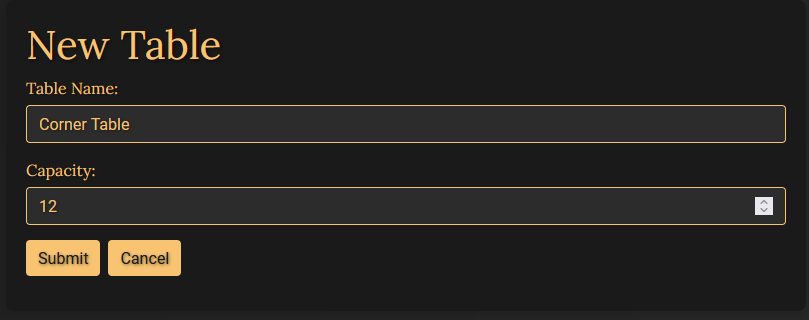
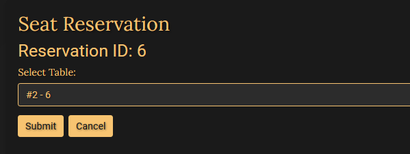
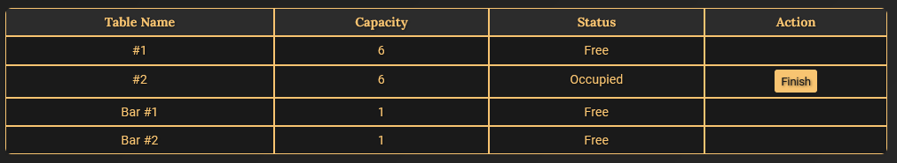
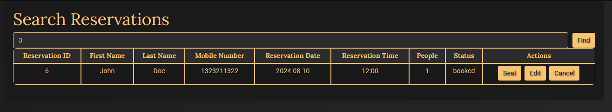
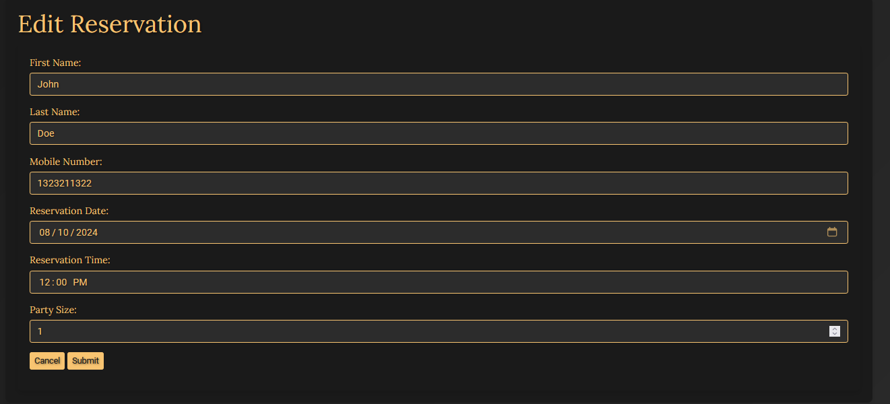

# Restaurant-Reservation-System

This full-stack application provides a comprehensive solution for restaurant reservation management. It allows restaurants to create, update, and delete reservations efficiently. The system also includes table management features, ensuring optimal seating arrangements and improved customer service.

## Live Demo
- **Frontend:** Hosted at [Frontend](https://reservation-frontend-v0bx.onrender.com)
- **Backend:** Hosted at [Backend](https://reservation-backend-63rq.onrender.com)

*Note: Render spins down sites when not in use. You may need to visit the backend URL first to activate it, enabling the frontend to make API calls.*


## Technology Stack

- **Frontend**: React, JavaScript, JSX, Bootstrap
- **Backend**: Node.js, Express
- **Database**: PostgreSQL
- **ORM**: Knex.js
- **API**: RESTful architecture

## System Requirements

- **Node.js** v16.20 or higher
- **PostgreSQL**

## Key Features

### Dashboard (/dashboard)


- Display reservations for a specific date (default: today)
- Navigation buttons for date selection (Next, Previous, Today)
- List of all tables with availability status
- Reservation management actions (Seat, Finish)
- Real-time status updates for reservations and tables

### New Reservation (/reservations/new)


- Comprehensive form for creating new reservations
- Validation for reservation date and time
- Error handling for invalid inputs or constraint violations

### New Table (/tables/new)


- Form for adding new tables
- Validation for table name and capacity

### Seat Reservation (/reservations/:reservation_id/seat)



- Interface for assigning reservations to specific tables
- Capacity checks to ensure proper seating arrangements

### Search Functionality (/search)


- Search reservations by phone number
- Display all matching reservations regardless of status

### Edit Reservation (/reservations/:reservation_id/edit)


- Modify existing reservations (status: "booked" only)
- Pre-filled form with current reservation details

## Installation and Setup

1. **Clone the repository:**
    ```bash
    git clone https://github.com/Brad-Galindo/Resturant-Reservation-System.git
    ```

2. **Install dependencies:**
    ```bash
    cd restaurant-reservation-system
    npm install
    ```

3. **Set up environment variables:**
   - Create a `.env` file in the root directory and add necessary variables (database connection, API keys, etc.)

4. **Initialize the database:**
    ```bash
    npm run knex migrate:latest
    npm run knex seed:run
    ```

5. **Start the development server:**
    ```bash
    npm run start:dev
    ```

## Testing

Run the test suite with:
```bash
npm test
```

## Deployment

This application is configured for deployment on Render. Follow Render's documentation for deploying Node.js applications and PostgreSQL databases.

## Contributing

We welcome contributions to improve the Restaurant Reservation System. Please follow these steps:

1. Fork the repository
2. Create a new branch:
    ```bash
    git checkout -b feature/AmazingFeature
    ```
3. Commit your changes:
    ```bash
    git commit -m 'Add some AmazingFeature'
    ```
4. Push to the branch:
    ```bash
    git push origin feature/AmazingFeature
    ```
5. Open a Pull Request

Thank you for your contributions!
